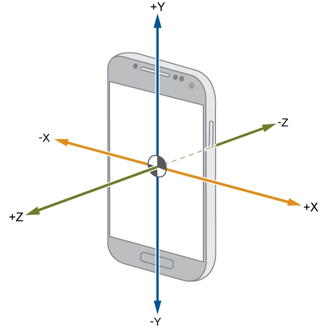
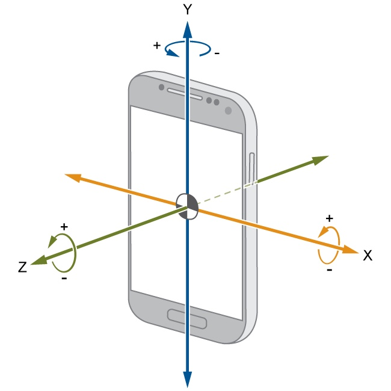

# Understanding Data

While other works focused solely on accelerometer data, most current smart
devices contain more carry-on sensors, like a gyroscope, which could provide
additional information. Moreover, the sensors were placed in strange places like
a band around the torso or a workout glove. If the goal is to create a commercial
product out of these findings, then it should be implemented in something more
practical, like a smartwatch, which already contains all of the required sensors.
Therefore, MbientLab’s wristband sensor research kit [12] was used to collect
data for this experiment. 

Los datos tomados se dividen de dos formas, los datos del acelerometro y las del giroscopio

## Datos del Acelerometro

x-axis (g),y-axis (g),z-axis (g) --> G force

## Datos del Giroscopio 

x-axis (deg/s),y-axis (deg/s),z-axis (deg/s) --> deg / s

## Understanding accelerometer and gyroscope data

Accelerometer data measured in G-forces (g) — A single G-force for us here on planet Earth is equivalent to 9.8 m/s^2 (speed)

Gyroscope data measured in degrees/seconds (rotation)

